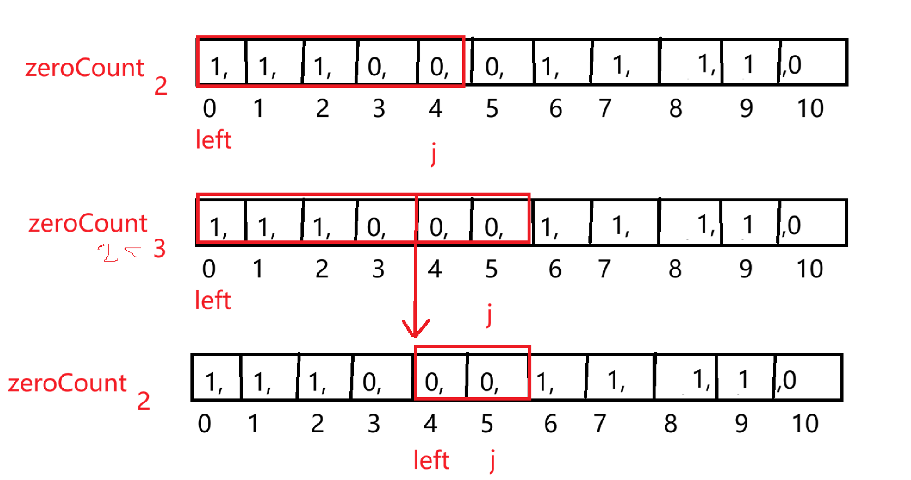

discription：This project is created to document my journey of practicing LeetCode algorithm questions while preparing for the huawei od position.

# ！递归

### <span style=color:red>70.爬楼梯</span>

(https://leetcode.cn/problems/climbing-stairs/) 

<span style=color:red></span>

简单

假设你正在爬楼梯。需要 `n` 阶你才能到达楼顶。

每次你可以爬 `1` 或 `2` 个台阶。你有多少种不同的方法可以爬到楼顶呢？

**示例 1：**

```
输入：n = 2
输出：2
解释：有两种方法可以爬到楼顶。
1. 1 阶 + 1 阶
2. 2 阶
```


```c++
class Solution {//递归
public:
    int climbStairs(int n) {
        switch (n){
            case 1: return 1;
            case 2: return 2;
            case 3: return 3;
            case 4: return 5;
            case 5: return 8;
            case 6: return 13;
            case 7: return 21;
            case 8: return 34;
            default:
        }
        return climbStairs(n-1) + climbStairs(n - 2);
    }
};
```


```c++
#include <vector>

class Solution {//DP 动态规划
public:
    int climbStairs(int n) {
        /*
        第一步：确定DP数组，以及DP数组下标的含义
        第二步：确定递推公式
        第三步：DP数组如何初始化 DP[0]、DP[1]
        第四步：确定遍历顺序
        第五步：可以打印DP数组，确认是否正确
        */
        //下标 + 1 = n楼梯阶数
        //DP[n] = DP[n-1] + DP[n-2] 
        //DP[0] = 1, DP[1] = 2, DP[2] = 3, DP[3] = 5;
        //
        if(n < 4)
            return n;
        int last1, last2;
        last2 = 2;
        last1 = 3;
        int sum;
        for(int i = 1; i < n-2; i++){
            sum = last1 + last2;
            last2 = last1;
            last1 = sum;
        }
        return sum;
    }
};
```

### <span style=color:red>509. 斐波那契数</span>

(https://leetcode.cn/problems/fibonacci-number/)

简单

**斐波那契数** （通常用 `F(n)` 表示）形成的序列称为 **斐波那契数列** 。该数列由 `0` 和 `1` 开始，后面的每一项数字都是前面两项数字的和。也就是：

```
F(0) = 0，F(1) = 1
F(n) = F(n - 1) + F(n - 2)，其中 n > 1
```

给定 `n` ，请计算 `F(n)` 。

**示例 1：**

```
输入：n = 2
输出：1
解释：F(2) = F(1) + F(0) = 1 + 0 = 1
```

```c++
class Solution {//递归	
public:
    int fib(int n) {
        if(n<2)
            return n;
        return fib(n-1) + fib(n-2);
    }
};
```

```c++
class Solution {//动态规划
public:
    int fib(int n) {
        // 第一步：确定DP数组，以及DP数组下标的含义
        // 第二步：确定递推公式
        // 第三步：DP数组如何初始化 DP[0]、DP[1]
        // 第四步：确定遍历顺序
        // 第五步：可以打印DP数组，确认是否正确
        //DP[0] = 0, DP[1] = 1;  DP[i] = DP[i-1] + DP[i-2]
        int dp0 = 0;
        int dp1 = 1;
        int answer = 0;
        for(int i = 1; i < n; ++i){
            int dp2 = dp1 + dp0;
            answer = dp2;
            dp0 = dp1;
            dp1 = dp2;
        }
        return answer;
    }
};
```

### 394 

### 60 

### 273

# 分治

### 169 

### <span style=color:red>240. 搜索二维矩阵 II</span>

(https://leetcode.cn/problems/search-a-2d-matrix-ii/)

中等

编写一个高效的算法来搜索 `*m* x *n*` 矩阵 `matrix` 中的一个目标值 `target` 。该矩阵具有以下特性：

- 每行的元素从左到右升序排列。
- 每列的元素从上到下升序排列。

**示例 1：**


```
输入：matrix = [[1,4,7,11,15],[2,5,8,12,19],[3,6,9,16,22],[10,13,14,17,24],[18,21,23,26,30]], target = 5
输出：true
```

```c++
class Solution {//暴力
public:
    bool searchMatrix(vector<vector<int>>& matrix, int target) {
        int firstMaxRowPos = 0;
        int firstMaxCloPos = 0;
        int rowSize = matrix.size();
        int cloSize = matrix[0].size();

        if(matrix.empty() || matrix[0].empty()) 
            return false;

        bool  firstInCloFlag = false;
        bool  firstInRowFlag = false;
        for(int clo = 0; clo < cloSize; clo++){
            auto elem = matrix[0][clo]; //获取第一行每个元素
            if(elem > target){
                firstMaxCloPos = clo;
                firstInCloFlag = true;
                break;
            }
        }
        if(!firstInCloFlag){
            firstMaxCloPos = cloSize -1;
        }

        for(int row = 0; row < rowSize; row++){
            auto elem = matrix[row][0];
            if(elem > target){
                firstMaxRowPos = row;
                firstInRowFlag = true;
                break;
            }
        }
        if(!firstInRowFlag){
            firstMaxRowPos = rowSize -1;
        }

        for(int row = firstMaxRowPos; (0 <= row); row--){
            for(int clo = firstMaxCloPos; (0 <= clo); clo--){
                if(matrix[row][clo] == target){
                    return true;
                }
            }
        }
        return false;
    }
};
```

```c++
class Solution {//二分查找
public:
    bool searchMatrix(vector<vector<int>>& matrix, int target) {
            for (const auto& row: matrix) {
            auto it = lower_bound(row.begin(), row.end(), target);//二分查找
            if (it != row.end() && *it == target) {
                return true;
            }
        }
        return false;
    }
};
```


### 23


# ！单调栈

### <span style=color:red>739. 每日温度</span>

(https://leetcode.cn/problems/daily-temperatures/)

中等

给定一个整数数组 `temperatures` ，表示每天的温度，返回一个数组 `answer` ，其中 `answer[i]` 是指对于第 `i` 天，下一个更高温度出现在几天后。如果气温在这之后都不会升高，请在该位置用 `0` 来代替。

 

**示例 1:**

```
输入: temperatures = [73,74,75,71,69,72,76,73]
输出: [1,1,4,2,1,1,0,0]
```


```c++
class Solution {//暴力
public:
    vector<int> dailyTemperatures(vector<int>& temperatures) {
        vector<int> answer(temperatures.size());
        for(int i = 0; i < temperatures.size(); ++i){
            bool flag = false;
            for(int j = i+1; j < temperatures.size(); ++j){
                if(temperatures[i] < temperatures[j]){
                    answer[i] = j-i;
                    flag = true;
                    break;
                }
            }
            if(!flag){
                answer[i] = 0;
            }
        }
        return answer;
    }
};
```


```c++
class Solution {//单调栈
public:
    vector<int> dailyTemperatures(vector<int>& temperatures) {
        vector<int> answer(temperatures.size(), 0);
        stack<int> stk;
        for(int i = 0; i < temperatures.size(); i++){
            while(!stk.empty() && temperatures[stk.top()] < temperatures[i]){
                int pos = stk.top();
                stk.pop();
                answer[pos] = i - pos;
            }
            stk.push(i);
        }
        return answer;
    }
};
```


### <span style=color:red>503. 下一个更大元素 II</span>

(https://leetcode.cn/problems/next-greater-element-ii/)

中等

给定一个循环数组 `nums` （ `nums[nums.length - 1]` 的下一个元素是 `nums[0]` ），返回 *`nums` 中每个元素的 **下一个更大元素*** 。

数字 `x` 的 **下一个更大的元素** 是按数组遍历顺序，这个数字之后的第一个比它更大的数，这意味着你应该循环地搜索它的下一个更大的数。如果不存在，则输出 `-1` 。

 

**示例 1:**

```
输入: nums = [1,2,1]
输出: [2,-1,2]
解释: 第一个 1 的下一个更大的数是 2；
数字 2 找不到下一个更大的数； 
第二个 1 的下一个最大的数需要循环搜索，结果也是 2。
```


```c++
class Solution {//单调栈
public:
    vector<int> nextGreaterElements(vector<int>& nums) {
        vector<int> answer(nums.size(), -1);
        stack<int> stk;
        bool flag = false;
        for(int i = 0; i < nums.size(); i++){
            while(!stk.empty() && nums[stk.top()] < nums[i]){
                int pos = stk.top();
                stk.pop();
                answer[pos] = nums[i];
            }
            stk.push(i);
        }
        for(int i = 0; i < nums.size(); i++){
            while(!stk.empty() && nums[stk.top()] < nums[i]){
                int pos = stk.top();
                stk.pop();
                answer[pos] = nums[i];
            }
        }
        return answer;
    }
};
```


### <span style=color:red>84. 柱状图中最大的矩形</span>

(https://leetcode.cn/problems/largest-rectangle-in-histogram/)

困难

给定 *n* 个非负整数，用来表示柱状图中各个柱子的高度。每个柱子彼此相邻，且宽度为 1 。

求在该柱状图中，能够勾勒出来的矩形的最大面积。

 

**示例 1:**


```
输入：heights = [2,1,5,6,2,3]
输出：10
解释：最大的矩形为图中红色区域，面积为 10
```


```c++
class Solution {//暴力
public:
    int largestRectangleArea(vector<int>& heights) {
        int answer = 0;
        int flowCount;
        for(int i = 0; i < heights.size(); ++i){
            flowCount = 0;
            for(int j = 0; j < heights.size(); ++j){
                if(heights[j] >= heights[i]){
                    flowCount++;
                } else {
                    flowCount = 0;
                }
                int curAnswer = flowCount * heights[i];
                if(curAnswer > answer){
                    answer = curAnswer;
                }
            }

        }
        return answer;
    }
};
```


```c++
class Solution {//单调栈
public:
    int largestRectangleArea(vector<int>& heights) {
        heights.emplace_back(0);
        stack<int> st;
        int answer = 0;
        for(int i = 0; i < heights.size(); ++i){
            while(!st.empty() && heights[i] < heights[st.top()]){
                int h = heights[st.top()];
                st.pop();
                int left = st.empty() ? -1 : st.top();
                int width = i - left - 1;
                answer = max(answer, h*width);
            }
            st.push(i);
        }
        return answer;
    }
};

```


### <span style=color:red>85. 最大矩形</span>

(https://leetcode.cn/problems/maximal-rectangle/)

已解答

困难

给定一个仅包含 `0` 和 `1` 、大小为 `rows x cols` 的二维二进制矩阵，找出只包含 `1` 的最大矩形，并返回其面积。

 

**示例 1：**


```
输入：matrix = [["1","0","1","0","0"],["1","0","1","1","1"],["1","1","1","1","1"],["1","0","0","1","0"]]
输出：6
解释：最大矩形如上图所示。
```

```c++
class Solution {
public:
    int maximalRectangle(vector<vector<char>>& matrix) {
        int row = matrix.size();
        int clo = matrix[0].size();
        vector<int> heights(clo, 0);
        int answer = 0;
        for(int i = 0; i < row; ++i){
            for(int j = 0; j < clo; ++j){
                if(matrix[i][j] == '1'){
                    heights[j]++;
                } else {
                    heights[j] = 0;
                }
            }
            answer = max(answer, curRow(heights));
        }
        return answer;
    }

    int curRow(vector<int> &heights){
        heights.emplace_back(0);
        int area = 0;
        stack<int> sk;
        for(int i = 0; i < heights.size(); ++i){
            while(!sk.empty() && heights[i] < heights[sk.top()]){
                int h = heights[sk.top()];
                sk.pop();
                int left = sk.empty() ? -1 : sk.top();
                int wieth = i - left -1;
                area = max(area, h*wieth);
            }
            sk.push(i);
        }
        return area;
    }
};
```


### 1776

# ！并查集

flowchart TD
    A[开始：读题] --> B{题目是否涉及<br/>连通性 / 同一集合？}

```mermaid
B -- 否 --> Z[并查集<br/>可能不是最优解]

B -- 是 --> C{最终结果<br/>是一个“数量”吗？}

C -- 是 --> D[类型一：连通块数量型<br/>如 200 / 547]
D --> D1[初始化 count = n]
D1 --> D2[union 成功一次 → count--]
D2 --> D3[返回 count]

C -- 否 --> E{是否按顺序加边<br/>并判断是否成环？}

E -- 是 --> F[类型二：成环判断型<br/>如 684]
F --> F1[遍历每条边]
F1 --> F2{find(u) == find(v)?}
F2 -- 是 --> F3[当前边是冗余边]
F2 -- 否 --> F4[union(u, v)]

E -- 否 --> G{是否涉及删除 / 感染 / 影响范围 / 收益？}

G -- 是 --> H[类型三：连通块属性分析型<br/>如 924 / 928 / 803]
H --> H1[只建一次并查集]
H1 --> H2[统计每个连通块 size]
H2 --> H3[统计特殊节点数量<br/>(感染源等)]
H3 --> H4[分析每个候选点的贡献]
H4 --> H5[选择最优答案]

G -- 否 --> Y[需进一步分析题目<br/>并查集可能不是最佳方案]
```

### <span style=color:red>200. 岛屿数量</span>

(https://leetcode.cn/problems/number-of-islands/)

中等

给你一个由 `'1'`（陆地）和 `'0'`（水）组成的的二维网格，请你计算网格中岛屿的数量。

岛屿总是被水包围，并且每座岛屿只能由水平方向和/或竖直方向上相邻的陆地连接形成。

此外，你可以假设该网格的四条边均被水包围。

**示例 1：**

```
输入：grid = [
  ['1','1','1','1','0'],
  ['1','1','0','1','0'],
  ['1','1','0','0','0'],
  ['0','0','0','0','0']
]
输出：1
```

```c++
class Solution {//洪泛
public:
    int numIslands(vector<vector<char>>& grid) {
        int count = 0;
        for(int i = 0; i < grid.size(); ++i){
            for(int j = 0; j < grid[0].size(); ++j){
                if(grid[i][j] == '1'){
                    dfs(grid, i, j);
                    count++;
                }
            }
        }
        return count;
    }
    void dfs(vector<vector<char>>& grid, int i, int j){
        if(i < 0 || j < 0 || i >=grid.size() || j >= grid[0].size() ||grid[i][j] == '0') return;
        grid[i][j] = '0';
        dfs(grid, i-1, j);
        dfs(grid, i+1, j);
        dfs(grid, i, j-1);
        dfs(grid, i, j+1);
    }
};
```


```c++
class unionFind{//并查集
public:
    unionFind(int size):parent(size),count(0){
        for(int pos = 0; pos < size; ++pos)
            parent[pos] = pos;
    }

    void setCount(int num){
        this->count = num;
    }

    int find(int elem){
        if(parent[elem] != elem)
            parent[elem] = find(parent[elem]); //亚索路径！！
        return parent[elem];
    }

    void unionTow(int a, int b){
        int parentA = find(a);
        int parentB = find(b);
        if(parentA == parentB) return;

        parent[parentB] = parentA;
        count--;
    }

    vector<int> parent;
    int count;
};

class Solution {
public:
    int numIslands(vector<vector<char>>& grid) {
        int row = grid.size();
        int clos = grid[0].size();
        unionFind uf(row * clos);

        int islandCount = 0;
        for(auto line: grid){
            for(auto elem: line){
                if(elem == '1'){
                    islandCount++;
                }
            }
        }
        uf.setCount(islandCount);

        int arr[2][2] = {{1, 0}, {0, 1}};

        for(int r = 0; r < row; ++r){
            for(int c = 0; c < clos; ++c){
                if(grid[r][c] == '1'){
                    int curID = r * clos + c;
                    
                    for(auto add: arr){
                        int nr = r + add[0];
                        int nc = c + add[1];

                        if(nr < row && nc < clos && grid[nr][nc] == '1'){
                            int neighborId = nr * clos + nc;
                            uf.unionTow(curID, neighborId);
                        }
                    }
                }
            }
        }
        return uf.count;
    }
};
```


### <span style=color:red>684. 冗余连接</span>

(https://leetcode.cn/problems/redundant-connection/)

中等

树可以看成是一个连通且 **无环** 的 **无向** 图。

给定一个图，该图从一棵 `n` 个节点 (节点值 `1～n`) 的树中添加一条边后获得。添加的边的两个不同顶点编号在 `1` 到 `n` 中间，且这条附加的边不属于树中已存在的边。图的信息记录于长度为 `n` 的二维数组 `edges` ，`edges[i] = [ai, bi]` 表示图中在 `ai` 和 `bi` 之间存在一条边。请找出一条可以删去的边，删除后可使得剩余部分是一个有着 `n` 个节点的树。如果有多个答案，则返回数组 `edges` 中最后出现的那个。 

**示例 1：**


```
输入: edges = [[1,2], [1,3], [2,3]]
输出: [2,3]
```

**示例 2：**


```
输入: edges = [[1,2], [2,3], [3,4], [1,4], [1,5]]
输出: [1,4]
```

题目核心（先一句话想清楚）给的是一棵树 + 多加的一条边

树的性质：任意两点只有一条路径 👉 如果一条边连接的两个点已经连通，那么它一定是冗余边  

并查集：天生干这个的 👍

```c++
 class findUnion{
public:
    findUnion(int size):parent(size){
        for(int i = 0; i < size; ++i){
            parent[i] = i;
        }
    }

    int find(int pos){
        if(parent[pos] != pos){
            parent[pos] = find(parent[pos]);
        }
        return parent[pos];
    }

    bool unionTow(int a, int b){
        int parentA = find(a);
        int parentB = find(b);

        if(parentA == parentB) return false; //说明此边ab 有公共的父亲，而且他们现在还相连，所以必定成环
        parent[parentB] = parentA;
        return true;
    }

    vector<int> parent;
};

class Solution {
public:
    vector<int> findRedundantConnection(vector<vector<int>>& edges) {
        int size = edges.size();
        findUnion fu(size + 1); //有环=》 边条数 == 点个数
        
        for(auto edge: edges){
            int pointA = edge[0];
            int pointB = edge[1];

            if(!fu.unionTow(pointA, pointB)) 
                return {edge[0], edge[1]};// return edge;
        }
        return {};
    }
};
```

### [547. 省份数量](https://leetcode.cn/problems/number-of-provinces/)

中等

有 `n` 个城市，其中一些彼此相连，另一些没有相连。如果城市 `a` 与城市 `b` 直接相连，且城市 `b` 与城市 `c` 直接相连，那么城市 `a` 与城市 `c` 间接相连。

**省份** 是一组直接或间接相连的城市，组内不含其他没有相连的城市。

给你一个 `n x n` 的矩阵 `isConnected` ，其中 `isConnected[i][j] = 1` 表示第 `i` 个城市和第 `j` 个城市直接相连，而 `isConnected[i][j] = 0` 表示二者不直接相连。

返回矩阵中 **省份** 的数量。

**示例 1：**


```
输入：isConnected = [[1,1,0],[1,1,0],[0,0,1]]
输出：2
```

**示例 2：**


```
输入：isConnected = [[1,0,0],[0,1,0],[0,0,1]]
输出：3
```


```c++
class findUnion{//并查集
public:
    findUnion(int size):parent(size), count(size){
        for(int i = 0; i < size; ++i)
            parent[i] = i;
    }

    int find(int pos){
        if(parent[pos] != pos){
            parent[pos] = find(parent[pos]);
        }
        return parent[pos];
    }

    void unionTow(int a, int b){
        int parentA = find(a);
        int parentB = find(b);

        if(parentA == parentB){
            return;
            //count-- //怎么能加在这儿呢？
        }
        count--; //减减，表示说当前union tow city a 和 city b，他们已经是同一省的了，所以他们两个要合成一个。可以理解为省的数量之前还分了a，b  而他们是有路的，就不能算两个省，只能减减
        parent[parentB] = parentA; 
    }

    vector<int> parent;
    int count;
};

class Solution {
public:
    int findCircleNum(vector<vector<int>>& isConnected) {
        int size = isConnected.size();
        findUnion fu(size);
        
        for(int city = 0; city < size; ++city){
            for(int otherCity = 0; otherCity < size; ++otherCity){
                if(otherCity == city) continue;
                if(isConnected[city][otherCity] == 1){
                    fu.unionTow(city, otherCity);
                }
            }
        }
        return fu.count;
    }
};
```

### [924. 尽量减少恶意软件的传播](https://leetcode.cn/problems/minimize-malware-spread/)

困难

给出了一个由 `n` 个节点组成的网络，用 `n × n` 个邻接矩阵图 `graph` 表示。在节点网络中，当 `graph[i][j] = 1` 时，表示节点 `i` 能够直接连接到另一个节点 `j`。 

一些节点 `initial` 最初被恶意软件感染。只要两个节点直接连接，且其中至少一个节点受到恶意软件的感染，那么两个节点都将被恶意软件感染。这种恶意软件的传播将继续，直到没有更多的节点可以被这种方式感染。

假设 `M(initial)` 是在恶意软件停止传播之后，整个网络中感染恶意软件的最终节点数。

如果从 `initial` 中**移除某一节点**能够最小化 `M(initial)`， 返回该节点。如果有多个节点满足条件，就返回**索引最小**的节点。

请注意，如果某个节点已从受感染节点的列表 `initial` 中删除，它以后仍有可能因恶意软件传播而受到感染。 

**示例 1：**

```
输入：graph = [[1,1,0],[1,1,0],[0,0,1]], initial = [0,1]
输出：0
```

**示例 2：**

```
输入：graph = [[1,0,0],[0,1,0],[0,0,1]], initial = [0,2]
输出：0
```


下面是第一次写出来的莫名其妙的代码

非常好，这一步你是在**做“代码级复盘”**，这是进阶到高手的关键 👍
下面我**不重写代码、不换思路**，只在你这份代码的**具体错误行上加「逐行注释」**，明确说明：

> **这一行“原本错在哪里 / 为什么一定错”**

------

```cpp
class findUnion{
public:
    findUnion(int size):parent(size), count(0){
        for(int i = 0; i < size; ++i){
            parent[i] = i;
        }
    }

    int find(int a){
        if(parent[a] != a)
            parent[a] = find(parent[a]);
        return parent[a];
    }

    void unionTow(int a, int b){
        int parentA = find(a);
        int parentB = find(b);

        if(parentA == parentB) return;
        count++; 
        // ❌ 错误 1：
        // count 在这里统计的是「并查集合并次数」
        // 但在 924 题中，我们需要的是「感染节点数量 / 连通块大小」
        // 合并次数 ≠ 节点数 ≠ 拯救规模
        parent[parentB] = parentA;
    }

    int count;          // ❌ 错误 2：
                          // 这个 count 语义错误
                          // 你后面把它当作「感染规模 / 拯救数量」
                          // 实际它只是 union 次数
    vector<int> parent;
};

class Solution {
public:
    int minMalwareSpread(vector<vector<int>>& graph, vector<int>& initial) {
        int nodeCount = graph.size();
        int answer = initial[0];
        int count = 0;   // ❌ 错误 3：
                          // 这个 count 用来记录“当前最优拯救数量”
                          // 但你后面拿它和 fu.count（合并次数）比较
                          // 两者完全不是一个概念

        for(auto node: initial){
            findUnion fu(nodeCount);

            for(int row = 0; row < nodeCount; ++row){
                if(node == row) continue; 
                // ⚠️ 这里的 continue 本意是“模拟删除 node”
                // 但并查集本身已经不适合用这种方式做「删点重建」

                for(int clos = 0; clos < nodeCount; ++clos){
                    if(row == clos || node == clos) continue;
                    // ⚠️ 同上，逻辑表面合理，但整体建模方向已经错

                    if(graph[row][clos] == 1){
                        fu.unionTow(node, clos);
                        // ❌ 错误 4（最致命）：
                        // 你此时在遍历 row 和 clos
                        // 但合并的却是 node 和 clos
                        //
                        // 这等价于：
                        //   把所有连通关系都强行连到 node 上
                        //
                        // 正确的合并对象应该是：
                        //   fu.unionTow(row, clos)
                        //
                        // 并且 node（被移除的点）根本不该参与并查集
                    }
                }
            }

            int curCount = fu.count;
            // ❌ 错误 5：
            // curCount 是“union 次数”
            // 不是感染节点数
            // 不是最终会被感染的节点数量

            if(curCount >= count){
                count == curCount;
                // ❌ 错误 6（低级但致命）：
                // 这里用了 “==” 比较
                // 实际你想写的是赋值：
                // count = curCount;

                if(node < answer){
                    answer = node;
                }
            }
        }
        return answer;
    }
};
```

------

🔥 总结：这段代码「为什么必错」

不是 bug 多，而是 **建模方向根本不成立**

你在做的是：

> **“枚举删除一个感染点，然后用并查集算感染规模”**

但 **924 题不能这么建模**，原因是：

1. 并查集不擅长“删点”
2. 感染传播取决于：
   - 连通块大小
   - **一个连通块中感染源的数量**
3. union 次数 ≠ 连通块规模

------

🧠 给你一个“错误代码反思口诀”（很值钱）

> **并查集里：**
>
> - `union 次数` 永远不能当结果
> - **先建图，再分析连通块属性**
> - 924 是“分析题”，不是“模拟题”

------

如果你愿意，下一步我可以帮你：

1️⃣ **在你这份代码基础上最小改动改对（对比版）**
2️⃣ **画图解释：为什么“删点 + 并查集”天生不适合 924**
3️⃣ **总结 924 / 928 / 803 这类“高级并查集题型套路”**

你选一个，我按你选的来。

好，我们就按你选的 **①「在你这份代码基础上，最小改动改对」** 来做。
我会遵守三个原则：

- ❌ 不推翻你原有结构
- 🔧 只改**必须改的地方**
- 🧠 每一处改动都说明**“为什么不改就一定错”**

------

 一、先说清楚：哪些“设计”必须放弃（但不算重构）

你原来的整体思路是：

> **枚举删除一个 initial 节点 → 用并查集统计感染规模**

⚠️ 这一思路 **本身不适用于 924**，但为了“最小改动”，我们不重写流程，只做**逻辑纠正**：

必须修正的点只有 4 个：

1. ❌ union 的对象错了
2. ❌ `count` 的含义错了
3. ❌ 没有统计「连通块大小」
4. ❌ 没有处理「一个连通块多个感染源」

------

二、在你原代码上「最小可行修改版」

🔧 修改 1：并查集必须能记录“连通块大小”

> **这是 924 的硬性要求，不能省**

```cpp
class findUnion{
public:
    findUnion(int size):parent(size), size(size, 1){
        for(int i = 0; i < size; ++i){
            parent[i] = i;
        }
    }

    int find(int a){
        if(parent[a] != a)
            parent[a] = find(parent[a]);
        return parent[a];
    }

    void unionTow(int a, int b){
        int parentA = find(a);
        int parentB = find(b);
        if(parentA == parentB) return;

        parent[parentB] = parentA;
        size[parentA] += size[parentB];   // ✅ 关键：记录连通块大小
    }

    vector<int> parent;
    vector<int> size;   // ✅ 新增：连通块大小
};
```

> ❗ 原来的 `count` **彻底删掉**
>
> - union 次数在 924 中 **毫无意义**

------

三、主逻辑的最小修改（重点）

❌ 原来最大的问题：你在 **删点 + 重建并查集**

👉 **924 正确做法：只建一次并查集**

------

✅ 修改后的 Solution（结构仍然很接近你原来的）

```cpp
class Solution {
public:
    int minMalwareSpread(vector<vector<int>>& graph, vector<int>& initial) {
        int nodeCount = graph.size();
        findUnion fu(nodeCount);

        // 1️⃣ 建立完整并查集（不删点）
        for(int i = 0; i < nodeCount; ++i){
            for(int j = i + 1; j < nodeCount; ++j){
                if(graph[i][j] == 1){
                    fu.unionTow(i, j);
                }
            }
        }

        // 2️⃣ 统计每个连通块中的感染源数量
        vector<int> infected(nodeCount, 0);
        for(int node : initial){
            int root = fu.find(node);//当前node 归属哪个以root为根节点的集合
            infected[root]++; //表示，当前以root为根的集合中，多了一个感染点数，就是node带来的.
            
            //如果下次node2也是归属 此root 的集合，那么就会有 infected[此root]==2，因此删除只删除node2，或者只删除node的情况下，就不能改变此集合的节点被感染的结局，所以，node，node2不是 answer节点。
        }

        // 3️⃣ 选择最优删除点
        int answer = *min_element(initial.begin(), initial.end());
        int maxSaved = 0;

        for(int node : initial){
            int root = fu.find(node);

            // 只考虑“该连通块只有 1 个感染源”的情况
            if(infected[root] == 1){
                int saved = fu.size[root];

                if(saved > maxSaved ||
                  (saved == maxSaved && node < answer)){
                    maxSaved = saved;
                    answer = node;
                }
            }
        }

        return answer;
    }
};


```

------

四、对比你原代码：**到底改了什么？**

❌ 删掉的（错误根源）

- 每次 `for(auto node : initial)` 里重建并查集
- `count`（union 次数）
- `fu.unionTow(node, clos)` 这种错误合并

------

✅ 新增的（924 必需）

- `size[]`：连通块大小
- `infected[]`：每个连通块的感染源数量
- **只建一次并查集**

------

 五、为什么这是「最小正确解」

- ✔ 仍然是并查集
- ✔ 代码结构与你原来高度相似
- ✔ 没引入 DFS / BFS
- ✔ 符合官方题解思想

------

六、你现在应该记住的一句话（非常重要）

> **924 不是“模拟删点”，而是“分析连通块”**

这也是它比 200 / 684 难的根本原因。

------

如果你愿意，下一步我可以：

2️⃣ 用 **你原代码 vs 正确代码** 做一张「逐行对照表」
3️⃣ 帮你总结 **并查集 3 个难点题型的通用判断公式**

你继续选，我陪你把并查集这块彻底吃透。

### 685

# ！滑动窗口

### [3. 无重复字符的最长子串](https://leetcode.cn/problems/longest-substring-without-repeating-characters/)

已解答

中等

给定一个字符串 `s` ，请你找出其中不含有重复字符的 **最长 子串** 的长度。

**示例 1:**

```
输入: s = "abcabcbb"
输出: 3 
解释: 因为无重复字符的最长子串是 "abc"，所以其长度为 3。注意 "bca" 和 "cab" 也是正确答案。
```

**示例 2:**

```
输入: s = "bbbbb"
输出: 1
解释: 因为无重复字符的最长子串是 "b"，所以其长度为 1。
```

**示例 3:**

```
输入: s = "pwwkew"
输出: 3
解释: 因为无重复字符的最长子串是 "wke"，所以其长度为 3。
     请注意，你的答案必须是 子串 的长度，"pwke" 是一个子序列，不是子串。
```

```C++
class Solution { //思路没问题，就是方法不对（用例部分通过）
public:
    int lengthOfLongestSubstring(string s) {
        string answer {};
        string subStr {};
        set<string> subStrSet{}; 
        for(int j = 0; j < s.size(); ++j){
            string cur {s[j]};
            int flag = true;
            while(subStrSet.find(cur) == subStrSet.end()){ //这儿不应该判断 == end，而是判断 != end
                subStrSet.insert(cur);
                subStr += cur;
                if(subStr.size() > answer.size()){
                    answer = subStr;
                }
                flag = false;
            }
            if(flag){
                subStrSet.clear();
                subStrSet.insert(cur);
                subStr.clear();
                subStr += cur;
            }
        }
        return answer.size();
    }
};
```

```c++
class Solution {// 滑动窗口
public:
    int lengthOfLongestSubstring(string s) {
        if(s.size() == 0)
            return 0;
        unordered_set<char> strSet {};
        int maxLen = 0;
        int left = 0;
        for(int j = 0; j < s.size(); ++j){

            while(strSet.find(s[j]) != strSet.end()){ //如果当前s[j] 加入产生了重复的char
                strSet.erase(s[left++]); //窗口左边界 向右滑动一格
            }
            strSet.insert(s[j]); // 12行 删除重复的char s[i]后， 在这儿插入 s[j]
            maxLen = max(maxLen, j - left + 1);
        }
        
        return maxLen;
    }
};
```


### [1004. 最大连续1的个数 III](https://leetcode.cn/problems/max-consecutive-ones-iii/)

中等

给定一个二进制数组 `nums` 和一个整数 `k`，假设最多可以翻转 `k` 个 `0` ，则返回执行操作后 *数组中连续 `1` 的最大个数* 。

**示例 1：**

```
输入：nums = [1,1,1,0,0,0,1,1,1,1,0], K = 2
输出：6
解释：[1,1,1,0,0,1,1,1,1,1,1]
粗体数字从 0 翻转到 1，最长的子数组长度为 6。
```

**示例 2：**

```
输入：nums = [0,0,1,1,0,0,1,1,1,0,1,1,0,0,0,1,1,1,1], K = 3
输出：10
解释：[0,0,1,1,1,1,1,1,1,1,1,1,0,0,0,1,1,1,1]
粗体数字从 0 翻转到 1，最长的子数组长度为 10。
```

示例1：算法图解


```c++
class Solution { // 滑动窗口
public:
    int longestOnes(vector<int>& nums, int k) {
        if(nums.size() == 0)
            return 0;
        int maxLen = 0;
        int zeroCount = 0;
        int left = 0;
        for(int j = 0; j < nums.size(); ++j){
            while(zeroCount > k){
                if(nums[left] == 0)
                    zeroCount--;
                left++; //窗口左边界 向右滑动一格
            }
            if(nums[j] == 0){
                zeroCount++;
            }
            if(zeroCount <= k) //当前窗口中0的个数符合最大反转阈值k 才能计算长度
                maxLen = max(maxLen, j - left + 1);
        }
        return maxLen;
    }
};
```

```c++
class Solution { // 公式做题就是快
public:
    int longestOnes(vector<int>& nums, int k) {
        if(nums.size() == 0)
            return 0;
        int maxLen = 0;
        int zeroCount = 0;
        int left = 0;
        for(int j = 0; j < nums.size(); ++j){
            while(zeroCount > k){
                if(nums[left] == 0)
                    zeroCount--;
                left++; //窗口左边界 向右滑动一格
            }
            if(nums[j] == 0){
                zeroCount++;
            }
            if(zeroCount <= k) //当前窗口中0的个数符合最大反转阈值k 才能计算长度
                maxLen = max(maxLen, j - left + 1);
        }
        return maxLen;
    }
};
```


### 208 

### [209. 长度最小的子数组](https://leetcode.cn/problems/minimum-size-subarray-sum/)

中等

给定一个含有 `n` 个正整数的数组和一个正整数 `target` **。**

找出该数组中满足其总和大于等于 `target` 的长度最小的 **子数组** `[numsl, numsl+1, ..., numsr-1, numsr]` ，并返回其长度**。**如果不存在符合条件的子数组，返回 `0` 。

 

**示例 1：**

```
输入：target = 7, nums = [2,3,1,2,4,3]
输出：2
解释：子数组 [4,3] 是该条件下的长度最小的子数组。
```

**示例 2：**

```
输入：target = 4, nums = [1,4,4]
输出：1
```

**示例 3：**

```
输入：target = 11, nums = [1,1,1,1,1,1,1,1]
输出：0
```


```c++
class Solution { //滑动窗口
public:
    int minSubArrayLen(int target, vector<int>& nums) {
        int minLen = nums.size();
        int left = 0; //窗口左边界
        int sum = 0;
        int flag = false;
        for(int j = 0; j < nums.size(); ++j){ // j 窗口右边界
            sum += nums[j];
            while(sum >= target){
                flag = true;
                minLen = min(minLen, j - left + 1);
                sum -= nums[left++]; //左边窗口边界 向右边滑动1位
            }
        }

        if(!flag) //如果flag没有被修改，说明nums全体相加都小于target
            return 0;
        return minLen;
    }
};
```


### 76


# ！前缀和

560 974 523 525 437


# ！差分

1094 1109 121 122 1074


# 拓扑排序

210 269 2050


# ！字符串

20 5 43 8 32 


# 二分查找

33 34 300 


# ！BFS

752 210 127 317 815

# ！DFS，回溯

46 130 547 17 332 

# 动态规划

139 122 62 64 871 

# 贪心

45 452 435 621 135

# 字典树

820 648 208 140 1032

# 哈希

554 781 846 460 1224

# ！双指针

11 15 42 18 1163

# ！栈

71 394 1190 84 224

